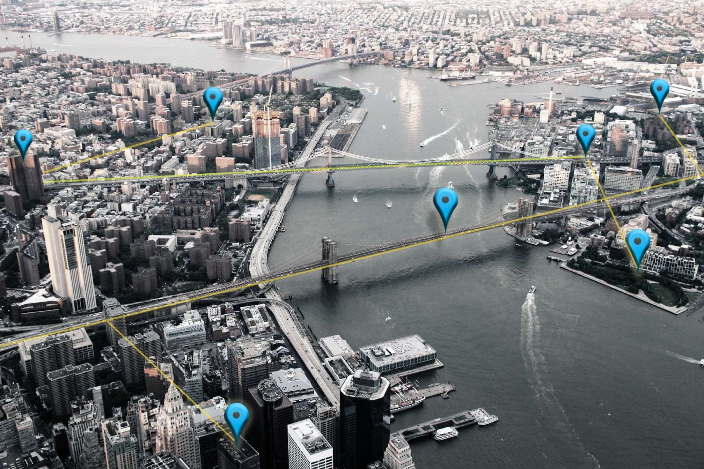

# The Unfairness of Active Users and Popularity Bias in Point-of-Interest Recommendation



This project focuses on the point of interest (POI) recommendation and state-of-the-art algorithms in the POI domain regarding the trade-offs between the accuracy of personalizing and fairness in recommendations to both users and providers.

## 💡 Evaluation Results

By analyzing the performance of various algorithms on three real-world POI datasets, we found that:

- State-of-the-art algorithms work against user fairness by favoring a small percentage of highly active users with superior recommendations.
- A more significant percentage of less active users receive imprecisely tailored recommendations.
- Most recommender systems recommend popular locations or items contributing to item unfairness.

⚠️ Note: Visit our [web page](https://recsys-lab.github.io/FairPOI/ "web page") for full table results.

## ☑️ Re-generating the results

You will need below libraries to be installed before running the application:

- Python >= 3.7
- NumPy >= 1.19
- SciPy >= 1.3

You can also run the command below in the root directory to get all of them installed:

```python
pip install -r requirements.txt
```

## ⚙️ Team

We are a diverse group of individuals who bring perspectives to the state-of-the-art projects:

| <a href="https://github.com/yasdel"></a> | <a href="https://github.com/rahmanidashti"></a> | <a href="https://github.com/alitourani"></a> | <a href="https://www.linkedin.com/in/ehsan-naghiaei"></a> |
| --------------------------------------------------------------------------------------------------- | ----------------------------------------------------------------------------------------------- | ---------------------------------------------------------------------------------------- | ---------------------------------------------------------------------------------------------------------------------------- |
| [Yashar Deldjoo](mailto:yashar.deldjoo@poliba.it "yashar.deldjoo@poliba.it")                        | [Hossein A. Rahmani](mailto:rahmanidashti@alumni.znu.ac.ir "rahmanidashti@alumni.znu.ac.ir")    | [Ali Tourani](mailto:tourani@msc.guilan.ac.ir "tourani@msc.guilan.ac.ir")                | [Mohammadmehdi Naghiaei](mailto:naghiaei@usc.edu "naghiaei@usc.edu")                                                         |

## 📝 Citation

Please cite the following [paper](https://arxiv.org/):

```
@article{rahmani2022fairPOI,
    author = {Saeed Rahmani, Yashar Deldjoo, Ali Tourani, and Mohammadmehdi Naghiaei},
    title = {The Unfairness of Active Users and Popularity Bias in Point-of-Interest Recommendation},
    journal = {ECIR 2022},
    volume = {XXX},
    year = {2021},
    url = {https://arxiv.org/abs/XXX},
    archivePrefix = {arXiv},
    eprint = {XXX}
}
```
